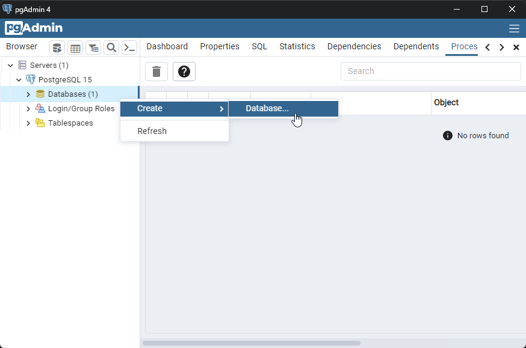

# Interactive Development zEnvironment Setup

**NOTE**: This guide currently covers the installation process for Windows. If you are on another
operating system, the instructions in some steps may be insufficient or incomplete.

## Overview

The basic steps for setting up a fully local interactive development environment from a fresh
installation are as follows:

1. Install the JDK
2. Install PostgreSQL
3. Load the database
4. Start the API Server
5. Start the Web App

## Install the JDK

Before running any gradle tasks with the gradle wrapper, ensure that Java 17 (minimum)
is on the path:

```
C:\Users\dev>java -version
java version "18.0.2.1" 2022-08-18
Java(TM) SE Runtime Environment (build 18.0.2.1+1-1)
Java HotSpot(TM) 64-Bit Server VM (build 18.0.2.1+1-1, mixed mode, sharing)
```

If an unsupported Java version is not installed, the JDK installer is available from Oracle
[here](https://www.oracle.com/java/technologies/downloads/).

## Install PostgreSQL

The installer packaged with pgAdmin can be found [here](https://www.enterprisedb.com/downloads/postgres-postgresql-downloads).

Download and run the installer, then click "next" through the menus while verifying the following:

1) ### Ensure that "pgAdmin 4" is checked on the components screen
   

2) ### Set the superuser user password to "password".
   

   - This is NOT a required step if [application.properties](../campuspath-api/src/main/resources/application.properties)
     is updated to reflect the desired value.

3) ### Ensure that the server port is set to "5432" (the default value)
   

   - This is NOT a required step if [application.properties](../campuspath-api/src/main/resources/application.properties)
     is updated to reflect the desired value.

4) ### Don't launch StackBuilder on exit, it won't be required.
   

## Load the Database

1) ### After installing PostgreSQL, launch "pgAdmin".
   
   
   If the application isn't searchable, the default installation path is:
   `C:\Program Files\PostgreSQL\VERSION\pgAdmin 4\bin\pgAdmin4.exe`

2) ### Enter the master user password if prompted, then create a new database:
   
   
   
   Set the name to "campuspath" and keep the rest of the settings the same

3) ### Use "Restore" to load the database from file
   
   


## Start the API Server

The server can be started using the gradlew wrapper script:

```
gradlew campuspath-api:bootRun
```

## Start the Web App

If you already have NPM and Angular CLI installed, running the following commands will work:

```
cd campuspath-web
ng serve
```

Otherwise, using the provided `ngServe` gradle task will download all the required packages
and start the angular development server (Be prepared for this step to take a while,
especially the first time it's run):

```
gradlew campuspath-web:ngServe
```

Once all packages are installed and the website is bundled, the following message should appear:


Navigate to the URL and you will be presented with a functional app:

<p float="left">
   
   
   
   
   
</p>
